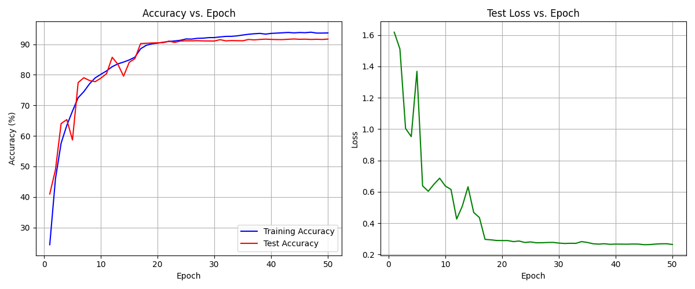
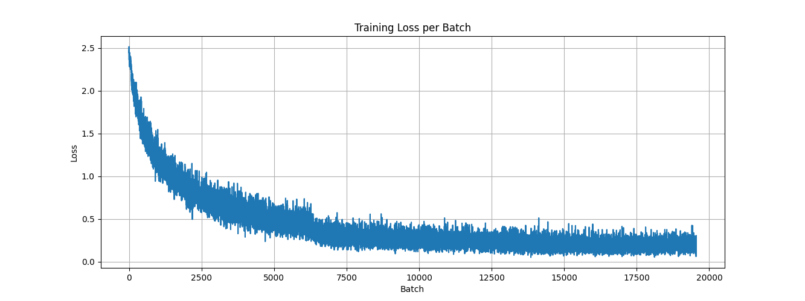
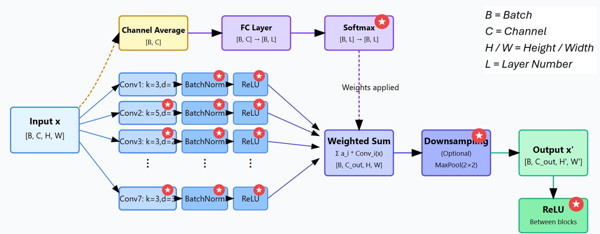
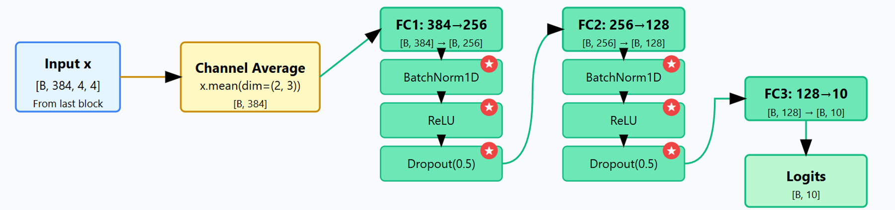
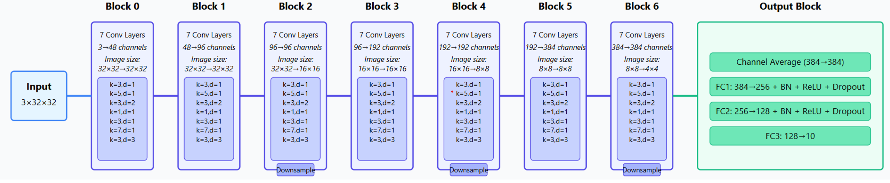

# CIFAR-10 Image Classification

**92.06% accuracy** on the CIFAR-10 dataset, approaching state-of-the-art performance without using conventional transformers or attention mechanisms. Instead, this architecture implements adaptive pathway weighting through SoftMax normalization, allowing the network to dynamically focus on the most relevant features for each input.

[Link to full report](report.md)

## Results

**Best Test Accuracy: 92.06%**

The minimal gap between training and test accuracy demonstrates good generalization with limited overfitting, validating the effectiveness of the applied regularization techniques.
## Architecture

### Intermediate Block

The model uses 7 parallel convolutional pathways with adaptive weighting to extract diverse features from inputs.

### Output Block

Three fully connected layers (256→128→10) with BatchNorm, ReLU, and dropout transform features into classification outputs.

### Main Architecture

Seven intermediate blocks progressively increase feature complexity while alternating between channel expansion and spatial reduction.

## Key Training Elements

- **Optimizer**: AdamW (lr=0.001, weight_decay=1e-4)
- **Augmentation**: Random crops, flips, and RandAugment
- **Scheduler**: ReduceLROnPlateau for dynamic learning rate adjustment
- **Batch Size**: 512 (training), 1024 (testing)
- **Regularization**: Dropout, weight decay, and data augmentation

