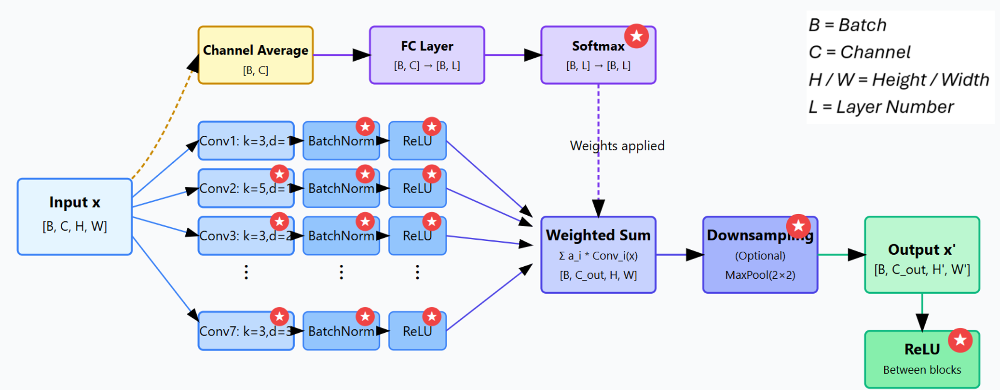
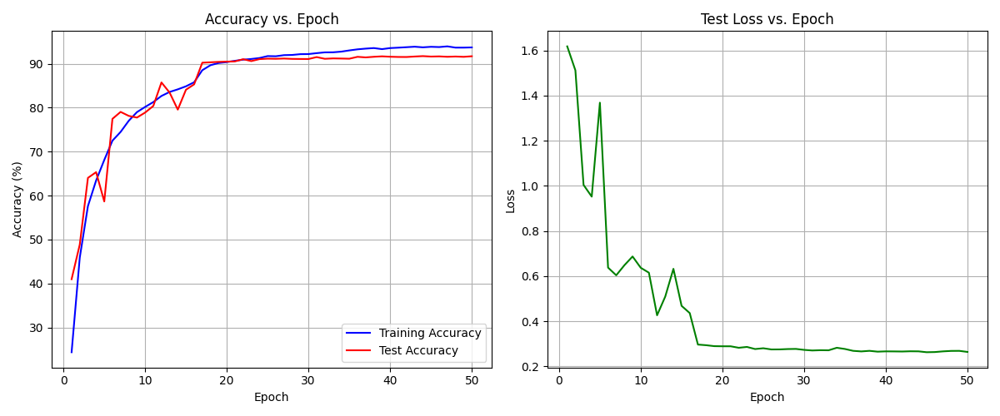
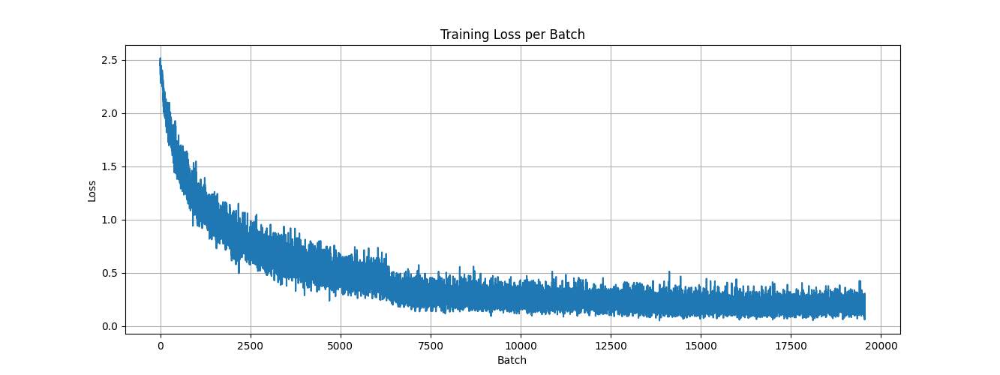

# CIFAR-10 

The report outlines my attempt at the popular CIFAR-10 image classification dataset. Which approaches state-of-the-art performance without using conventional transformers or attention mechanisms. Instead, this architecture implements adaptive pathway weighting through SoftMax normalization, allowing the network to dynamically focus on the most relevant features for each input.

## Final Architecture

This section outlines the architecture of the neural network that acheived **92.06% accuracy** . 

_The tensor dimensions are represented in \[ \] brackets and the letter meanings are shown in the diagram. The red Stars show where the implementation deviates from the initial architecture._

### Intermediate Block

The Intermediate Block is illustrated below. Each block receives an input image and processes it through 7 parallel convolutional layers with varying configurations. Each block dynamically computes weights for each convolutional pathway based on the input's channel averages, allowing the network to adaptively combine features.

#### Fully Connected Pathway

The fully connected (FC) layer pathway (at the top of the diagram) has SoftMax normalisation applied to create a competitive attention-like mechanism that adaptively weights different convolutional pathways based on input content. This ensures the weights are interpretable as a probability distribution and prevents any single feature extraction pathway from dominating.

#### Convolutional Pathways

In the end, 7 convolutional pathways were used. Each with a different configuration to enable it to capture a unique set of features to the others. Each unique layer has a distinct combination of kernel, padding and dilation settings which also ensures the image output is the same size as the input. The formula used is below.

Each layer has batch_normalisation (BN) applied and then rectified linear unit (ReLu) activation _function_. ReLu allows each layer to learn non-linear features, hence it is smart to apply these _to each layer_ instead of after the outputs are combined. The BN normalizes the output of each convolutional layer, stabilizing the learning process, accelerating training, and allowing higher learning rates while providing a regularization effect.

#### Weighted Sum Pathway

The convolutional layers are combined into the weighted sum of their outputs. This image is then, optionally, down sampled with MaxPooling using a 2x2 kernel – halving the image dimensions. The optionality of this down-sampling is to allow tuning of the receptive field and parameter numbers – which is discussed in more detail in the CIFAR10 architecture section.

After the down-sampling another ReLu layer is applied to introduce further non-linearity to the network. This additional activation function helps the network learn more complex representations from the combined features.

### Output Block

The output block transforms the averaged channel features into classification logits through a sequence of 3 fully connected layers with progressively decreasing dimensions (256→128→10). This dimensional reduction pathway allows the network to gradually transform complex feature representations into class-specific information. Each layer except the final one incorporates BatchNorm and ReLU activation, enhancing training stability and feature expressiveness, while 50% dropout is applied to prevent overfitting by forcing the network to learn redundant representations. The final layer outputs the 10 logits corresponding to the CIFAR-10 classes without activation, providing raw scores for the cross-entropy loss function.

### CIFAR10Net Block (Main block)

The overall architecture made use of the 7 unique layers repeating in each block. With 7 blocks used in total – the output of each becoming the input to either the next intermediate block or the output block. This design creates a progressively deeper feature hierarchy, with each successive block working with increasingly abstract representations of the original image.

Blocks 0 and 1 gradually increased the channel number, from 3 -> 48 -> 96, without down-sampling to let the model learn progressively more complex features. Blocks 2, 4 & 6 then apply down-sampling without changing the channel count to allow the model to 'consolidate' its learned features while increasing the receptive field and reducing the spatial dimensions. Blocks 3 and 5 maintain the steady increase of channel numbers without spatial reduction. By alternating these blocks, the network achieves an optimal balance between feature extraction capability and computational efficiency.

## Training Configuration

**Optimization**

- Optimizer: AdamW
  - Learning Rate: 0.001
  - Weight Decay: 1e-4
- Loss Function: Cross Entropy Loss

**Training Process**

- Batch Size:
  - Training: 512
  - Testing: 1024
- Training Duration:
  - Maximum Epochs: 100
  - Early Stopping:
    - Patience: 6
    - Metric: Test / val accuracy
- Data Shuffling: Training

**Learning Rate Management**

- Scheduler: ReduceLROnPlateau
  - Mode: max
  - Factor: 0.1
  - Patience: 3
  - Monitoring Metric: Test accuracy

**Data Augmentation & Processing**

- Image Transformations:
  - Random Crop: 32×32 with padding=4
  - Random Horizontal Flip: Enabled
  - RandAugment:
    - Number of operations: 2
    - Magnitude: 9
- **Normalization (per Channel)**:
  - Mean: (0.4914, 0.4822, 0.4465)
  - Standard deviation: (0.2470, 0.2435, 0.2616)
22 Misty's FldWalton-on-Thames KT12 2BG
## Final Accuracy
**Best Test Accuracy = 92.06%**

The model achieved a peak test accuracy of 92.06%. From the graphs, we can observe several key characteristics of the training process. Initially, both training and test accuracy show rapid improvement, while the training accuracy rose consistently, the test accuracy exhibited significant fluctuations between epochs 10-25. A notable phase shift occurs around epoch 25, where test accuracy jumps dramatically and stabilizes, coinciding with a substantial drop in test loss that plateaus around 0.25. The training loss per batch demonstrates consistent, smooth convergence throughout the training process. The minimal gap between final training (~93%) and test accuracy (~92%) indicates good generalization with limited overfitting, validating the effectiveness of the regularization techniques applied.
## Training History & Justification

Initially a 5 block / 5 layer architecture was trialled using typical convolutional hyperparameters. The output block was given 3 FC layers and the training batch size was 124. The data was normalised but no augmentation was applied. This gave okay accuracy (mid 70s %). To improve on this the following were applied with their justifications.

2 additional layers were added with wider kernels to capture a wider receptive field, and 2 additional blocks were added to increase the capacity of the model. **Weight decay** was applied to combat overfitting by penalizing large weights in the network, encouraging the model to learn simpler, more generalizable patterns. The value of **1e-4** provided regularization without excessively constraining the model.

**Batch size** was increased from **124 to 512** to improve training stability and take advantage of GPU parallelization. This provided a more reliable gradient estimate, accelerating convergence while maintaining generalization.

**Max epochs** was increased as the limit was reached in initial experiments before convergence. This allowed for more complete learning while relying on early stopping to prevent overfitting.

**Scheduler** was introduced to dynamically adjust the learning rate when performance plateaued. The **ReduceLROnPlateau** approach with **patience=3** allowed the model to escape local minima by reducing the learning rate by a factor of 10 when validation metrics stagnated.

Data augmentation steps including **random crops** with padding, **horizontal flips**, and **RandAugment** were implemented to artificially expand the training dataset and improve generalization. RandAugment's parameters (**operations=2, magnitude=9**) were specifically tuned to provide strong regularization without distorting class-specific features.

